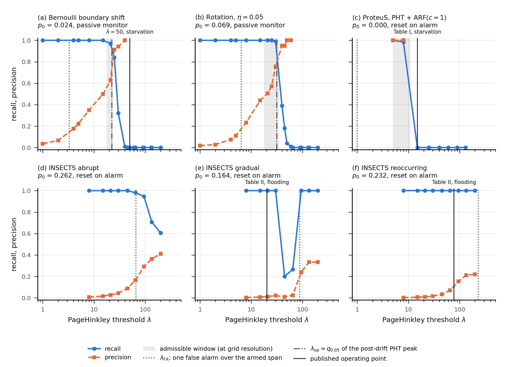

# Stream S10 — external validity, the dual mode, label latency

Branch `stream-s10`, parent `19b9bde`. The decision rules were fixed before any measurement in
[`S10_decision_rules.md`](S10_decision_rules.md) (`22252da`). Erratum E1 was committed before any
S10 computation (`88add36`). Transfer payloads: [`S10_transfer.md`](S10_transfer.md).

**Scope.** S10 measures. It edits no section of the manuscript, writes nothing under
`results/S6_*`, `S8_*`, `S9_*` or `R*_*`, and adds no entry to `authorized_deviations.txt`.
`sha256sum -c` against the frozen reference reads **27 OK / 7 FAILED** before and after the stream;
the seven are the declared deviations.

**Operator arbitration on T10.3.** The real streams are the three balanced INSECTS variants in
`data/insects/` and the three BAF variants. The other eight INSECTS files are not in the repository,
and River's download URL answers 404. Any extension would therefore add a dependency that a clean
clone cannot verify. The prompt's "INSECTS complet" is **not** met, by decision rather than by
omission.

## What the stream returned

| rule | verdict | one line |
|---|---|---|
| L0 | **PRESERVED** | The lag-0 trunk equals S6 and S8 (2000/2000 rows, 30/30 columns each) and reproduces all 80 S9 ordering cells. The smoke `err` column is bit-identical to S6's. |
| L1 | **P-a HOLDS** at every lag, both streams | Under shared latency the alarm moves by `l` (median data-index shift 0 or −1). |
| L2 | **P-b REFUTED**, both streams | Under shared latency erasure moves too: `T(500) − T(0)` = 0.998 `l` (canonical), 0.812 `l` (rotation). |
| L3 | **P-c REFUTED**, both streams | Under shared latency the budget read before erasure grows, ×2.53 and ×3.73 at `l` = 500. |
| L4 | M1 **REDUCED** ×2; M2 **INCREASED** (canonical), **NOT SHOWN** (rotation) | Monitor-only latency costs detection before erasure; shared latency does not. |
| DM1 | windows `{21}`, `[21, 30]`, `[5, 8]`; **EMPTY** on the three INSECTS panels | Precision never reaches 0.5 on INSECTS up to `lambda` = 200. |
| DM2 | upper edge **AGREES** with `lambda_op`; lower edge **DISAGREES** with `lambda_FA` | The flooding cliff sits well above the one-false-alarm span budget. |
| DM3 | **HOLDS** | All four published failures fail by the criterion of their own mode, and by that one only. |
| P0-2 | **REPRODUCED** | All 180 INSECTS cells equal S2-bis to the bit. |
| P0-3 | **IDENTICAL** | The round-trip BAF parse reproduces R5's committed adaptive-tree error on all three variants. |
| H0 | 3 of 18 not retained | `R5-abrupt_balanced`, `R4-alpha` and **`S10-L4-M2-rotation`** (withdrawn). |
| H1 | 4 of 39 not retained | Adds only `S6-homogeneity`, a non-rejection; all twenty KS tests survive. |

---

## 1. T10.1 — label latency

### 1.1 The prediction, and why it had to be split

The prompt predicted that latency moves `tau_det` by `l`, leaves `tau_erase` in place, and so
shrinks the exploitable window mechanically. That holds by construction if only the monitor waits
for the label (M1): the error sequence is the trunk's. It is a claim about the physics only if the
learner waits for the same label (M2). In that case the prediction at wall clock `t` is made by
`S_{t−l}`, the state that has learnt samples `0 .. t−l−1`. The learning sequence is unchanged and
`predict_one` draws no entropy (gate G0), so one run of the trunk, with the current state also
scoring `x[t + l]`, gives the M2 error stream exactly. The equivalence is tested against a forest
that really waits (FIFO, `l` = 10 and 50). L0 checks the trunk against S6 and S8. The competing
prediction for M2 — erasure moves by about `l`, the budget grows — was committed before any run
(Part A.4 of the rules).

### 1.2 Erratum E1, and what it prevented

As first written, Part B read erasure on the `def:times` W, the **last** crossing of `p0 + delta_P`
by a 200-step mean. That mean's noise at `p0 = 0.024` (≈ 0.011) exceeds `delta_P = 0.005`, so W is
set by the latest noise excursion before the horizon. On the committed S6 trunk, at the 11
magnitudes with `Delta_e ≤ 0.327`, its median is 1 908–2 264 against a 2 500 horizon. E1 replaced it,
before any S10 run, with the estimator the manuscript actually names `tau_erase`
(`\SixTauErase = 612`, the argmax of `A_unrefl`), searched from the lag-shifted first replacement.
The measurement shows what E1 avoided. On the rotation family, the `def:times` W has a median of
2 822 at the extended horizon, 59 % of runs beyond 2 000, and a shift of **0 at every lag**. The
argmax moves by 406 steps at `l` = 500. Had W been kept, the rotation stream would have
"confirmed" P-b by a horizon artefact.

A check made after E1 was committed, on the committed trunks: the argmax sits at the end of its
search window on 0.1 % (canonical) and 0.3 % (rotation) of runs. It is not pinned. The one demo cell
run before that check (seed 1, `Delta_e` = 0.25, both streams) changed no rule.

### 1.3 Measurements

Streams: canonical (`p0` median 0.024, range [0.012, 0.040]) and rotation `eta` = 0.05 (`p0` 0.069,
range [0.048, 0.085]). Both nulls are non-degenerate. Grid: 100 seeds × 20 magnitudes. CIs are
seed-cluster bootstraps (10 000 resamples, `deff` = 20); tests are seed-level sign tests.

**Canonical** (`A(0)` median 23.76)

| lag | `T(l) − T(0)` [CI] | ÷ `l` | L1 `d(l) − d(0)` at `lambda` = 15 | `A_avail^M1 / A(0)` | `A_avail^M2 / A(0)` | `def:times` W shift (n) |
|---|---|---|---|---|---|---|
| 10 | 0 [0, 0] | 0.00 | 0 [0, 0] | 0.975 | 1.080 | 3 (1 824) |
| 50 | 34 [22, 43] | 0.68 | 0 [−1, 0] | 0.939 | 1.352 | 40 (1 818) |
| 100 | 97 [88, 99] | 0.97 | −1 [−2, 0] | 0.883 | 1.630 | 92 (1 782) |
| 500 | 499 [497, 501] | 1.00 | −1 [−2, 0] | 0.000 | 2.530 | 488 (1 749) |

**Rotation** (`A(0)` median 53.07)

| lag | `T(l) − T(0)` [CI] | ÷ `l` | L1 `d(l) − d(0)` at `lambda` = 15 | `A_avail^M1 / A(0)` | `A_avail^M2 / A(0)` | `def:times` W shift (n) |
|---|---|---|---|---|---|---|
| 10 | 0 [0, 0] | 0.00 | 0 [0, 0] | 0.989 | 1.039 | 0 (1 180) |
| 50 | 0 [0, 0] | 0.00 | 0 [0, 0] | 0.974 | 1.267 | 0 (1 134) |
| 100 | 0 [0, 1] | 0.00 | 0 [−1, 0] | 0.960 | 1.570 | 0 (1 117) |
| 500 | 406 [296, 474] | 0.81 | 0 [−1, 0] | 0.868 | 3.734 | 0 (1 036) |

Detection, pooled over magnitudes. "Before erasure" means before the wall-clock deadline; "at all"
means a post-drift crossing within the horizon, on the data index.

| stream, `lambda` | lag 0 | 10 | 50 | 100 | 500 |
|---|---|---|---|---|---|
| canonical, 15, M1 before erasure | 0.924 | 0.854 | 0.662 | 0.565 | **0.240** |
| canonical, 15, M2 before erasure | 0.924 | 0.920 | 0.931 | 0.930 | **0.933** |
| canonical, 50, M2 at all | 0.052 | 0.149 | 0.705 | 0.811 | **0.902** |
| rotation, 15, M1 before erasure | 0.937 | 0.937 | 0.934 | 0.931 | **0.754** |
| rotation, 15, M2 before erasure | 0.937 | 0.927 | 0.926 | 0.897 | **0.914** |
| rotation, 50, M2 at all | 0.377 | 0.481 | 0.835 | 0.888 | **0.917** |

Under M1, detection at all is unchanged by construction: 0.942 and 0.952 at `lambda` = 15, 0.052
and 0.377 at `lambda` = 50, at every lag. The pre-drift alarm rate under M2 rises with staleness
(canonical 0.000 → 0.020, rotation 0.030 → 0.060 at `lambda` = 15).

Sign tests (per seed, `l` = 500 against 0): L2 99/1 and 84/7; L3 100/0 and 100/0; L4-M1 0/100 and
0/71; L4-M2 47/4 (`p` = 2.4e-10) and 21/12 (`p` = 0.163, not retained under Holm).

### 1.4 Reading

The prompt's prediction is a statement about a **differential** latency, the monitor waiting longer
than the learner. With monitor-only latency, erasure stays put, the deadline closes on the alarm and
detection before erasure falls from 0.924 to 0.240 at `l` = 500 on the canonical family. The evidence
itself is untouched: detection at all does not move. With a shared latency, adaptation waits for the
same labels the monitor waits for. The erasure recedes with them and the budget read before it
grows. At the starvation threshold `lambda` = 50, detection at all rises from 0.05 to 0.90. Label
latency does not open a second blind spot; when shared, it closes part of the first. It does so at
the price of delay: the alarm comes `l` steps later on the wall clock, and the classifier stays wrong
for `l` more steps.

The erasure moves with `l` only once the lag is comparable to adaptation. At `l` ≤ 50 (canonical)
and `l` ≤ 100 (rotation) the stale and current states predict alike on the same `x_t`. The error
paths then coincide and the argmax stays put. The distributional shift of Part A.4 is an
approximation at the time scale of adaptation, not an identity at every lag.

Out of scope and not measured: the windowed families (ADWIN, KSWIN) under latency, and any latency on
the real streams.

---

## 2. T10.2 — starvation and flooding on one threshold axis

`results/S10_external_validity/figures/Fig_S10_dual_mode.png`. Recall (solid) and precision
(dashed) against the PageHinkley threshold. The admissible window is drawn at grid resolution. The
dotted line is `lambda_FA`, one false alarm over the armed pre-change span. The dash-dot line is
`lambda_op`, the 5 % quantile of the post-drift PHT peak. Panels a and b: passive monitor on the S10
lag-0 traces, `Delta_e` = 0.326793. Panels c–f: the deployed protocol, monitor and classifier reset on
alarm, read off the S2-bis sweeps.

| panel | stream | `p0` | DM1 window | `lambda_FA` | `lambda_op` | DM2 lower / upper | published failure → DM3 |
|---|---|---|---|---|---|---|---|
| a | canonical | 0.024 | {21} | 3.30 | 22.50 | DISAGREES / AGREES | `lambda` = 50: recall 0.000, no alarm → **HOLDS** |
| b | rotation | 0.069 | [21, 30] | 6.42 | 31.67 | DISAGREES / AGREES | — |
| c | ProteuS, ARF `c` = 1 | 0.000 | [5, 8] | 1.00 (NOT BINDING) | — | DISAGREES / — | Table I `lambda` = 15: recall 0.000, no alarm → **HOLDS** |
| d | INSECTS abrupt | 0.262 | EMPTY | 65.95 | — | — | — (the weak witness) |
| e | INSECTS gradual | 0.164 | EMPTY | 88.80 | — | — | `lambda_ref` 20.39: recall 0.967, precision 0.011 → **HOLDS** |
| f | INSECTS reoccurring | 0.232 | EMPTY | 231.79 | — | — | `lambda_ref` 77.74: recall 1.000, precision 0.101 → **HOLDS** |

**What the figure establishes.** The dichotomy is one axis. Every published starvation sits past the
recall cliff with no false alarm. Every published flooding sits under the precision cliff with its
recall intact. The four points fail by one criterion each; none fails both. On the synthetic
families the window exists at 19 of 20 magnitudes (all but `Delta_e` = 0.028) and stays narrow: it
lies within [8, 21] on the canonical family and within [15, 30] on the rotation family. On the three INSECTS
variants, with the ARF at `c` = 1, **no threshold is admissible** on the grid: precision stays under
0.5 up to `lambda` = 200 while recall stays near 1.

**What it does not establish.** The lower cliff is not the pre-change false-alarm budget. The
threshold that buys one false alarm over the armed span (`lambda_FA` 3.3 and 6.4) lies an order of
magnitude below the precision edge (21). A monitor re-armed after each alarm keeps alarming through
and after the transient, so precision collapses at thresholds the pre-change span alone would clear.
On INSECTS the published operating points sit below `lambda_FA` (20.39 < 88.80; 77.74 < 231.79), as
the flooding reading requires, but precision stays under 0.5 even at `lambda_FA`. The upper cliff is
the evidence ceiling: `lambda_op` lands within one grid step of the recall edge on both synthetic
families. No `W`-dependent margin is used anywhere, because the reading of the symbol `W` is under
arbitration in S2-ter.

---

## 3. T10.3 — `p0` of every instrumented real stream

`p0_span` is the classifier's own mean error over the armed pre-change span `[warm-up, first valid
change)`, with the external detector disabled; `p0_warm` is the same over the warm-up. Both are
medians over 30 seeds. `adwin_arf_c1` builds the same ARF(`c` = 1) as `pht_arf_c1`, which a test
pins, so its `p0` is the `pht_arf_c1` column.

| stream | variant | pipeline | warm-up | span | `p0_warm` | `p0_span` [min, max] |
|---|---|---|---|---|---|---|
| BAF | Base | pht_ht | 100 000 | 25 000 | 0.0118 | 0.0122 [0.0122, 0.0122] |
| BAF | Base | pht_arf_c1 | 100 000 | 25 000 | 0.0114 | 0.0118 [0.0118, 0.0118] |
| BAF | Variant I | pht_ht | 100 000 | 25 000 | 0.0115 | 0.0112 [0.0112, 0.0112] |
| BAF | Variant I | pht_arf_c1 | 100 000 | 25 000 | 0.0112 | 0.0109 [0.0109, 0.0109] |
| BAF | Variant II | pht_ht | 100 000 | 25 000 | 0.0117 | 0.0108 [0.0108, 0.0108] |
| BAF | Variant II | pht_arf_c1 | 100 000 | 25 000 | 0.0115 | 0.0107 [0.0107, 0.0107] |
| INSECTS | abrupt_balanced | pht_ht | 5 284 | 9 068 | 0.3925 | 0.3755 [0.3755, 0.3755] |
| INSECTS | abrupt_balanced | pht_arf_c1 | 5 284 | 9 068 | 0.3298 | 0.2617 [0.2487, 0.2754] |
| INSECTS | gradual_balanced | pht_ht | 2 414 | 11 614 | 0.4234 | 0.3138 [0.3138, 0.3138] |
| INSECTS | gradual_balanced | pht_arf_c1 | 2 414 | 11 614 | 0.1319 | 0.1645 [0.1534, 0.1738] |
| INSECTS | incremental_reoccurring_balanced | pht_ht | 7 998 | 18 570 | 0.4135 | 0.3998 [0.3998, 0.3998] |
| INSECTS | incremental_reoccurring_balanced | pht_arf_c1 | 7 998 | 18 570 | 0.3041 | 0.2324 [0.2266, 0.2356] |

The Hoeffding tree draws no randomness, so its `p0` is seed-invariant. On BAF the ARF is too: it
predicts the majority class on every seed, and its error is the fraud rate. On INSECTS the ARF's
floor sits 0.11–0.17 under the tree's. Any ordering across these streams therefore compares
detectors whose base rates differ by a factor of 15 to 36 (0.011 against 0.164–0.400); this is
S9 D9's point, now with a number per stream. `results/S10_external_validity/tables/s10_table2_p0.tex`
is Table II with the two `p0` columns; nothing else in it is recomputed.

---

## 4. T10.4 — Holm over the enlarged family

**H0**, the verdict of record: the ten tests `protocol_v2.tex` declares plus the eight S10 members
(`m` = 18). **H1**: H0 plus the p-values the live manuscript carries outside the declared ten, twenty
KS exponentiality tests (`.tex:408`, `dependence_v2.tex:228`) and one Fisher homogeneity test
(`.tex:298`) (`m` = 39). Holm step-down at `alpha` = 0.05; a bootstrap `p` of 0 becomes
`1/(2000 + 1)`.

| family | not retained (rank, `p`, threshold) |
|---|---|
| declared ten alone | `R5-abrupt_balanced` (9, 0.0428, `alpha`/2); `R4-alpha` (10, 1.0) — protocol_v2's verdict, reproduced |
| H0, `m` = 18 | `R5-abrupt_balanced` (16, 0.0428, 0.0167); **`S10-L4-M2-rotation`** (17, 0.163, 0.025); `R4-alpha` (18, 1.0, 0.05) |
| H1, `m` = 39 | the three above, plus `S6-homogeneity` (39, 1.0, 0.05) |

**Withdrawn by the correction:** the rise of detection before erasure under shared latency on the
rotation family. S10 does not claim it. `R5-abrupt_balanced` and `R4-alpha` were already not claimed.
`S6-homogeneity` is a non-rejection used to license pooling: Holm cannot change it, and its reading
stands. Every other member survives both families, including all twenty KS tests; the largest
(`p` = 0.003) clears `alpha`/5. The declared family of `protocol_v2.tex` is nevertheless
**incomplete** as a census, which charge S10-A records.

---

## 5. Declared deviations and debts

| item | state |
|---|---|
| Erratum E1 | Committed before any S10 computation. `def:times` W is kept as a descriptive reading and shows the horizon pinning. |
| P0-3 oracle | R5's `error_stream_baf` reads uncompressed `data/baf/<variant>.csv`, which this worktree does not hold (only `.csv.gz`). Its committed output (`delta_e_oracle.parquet :: err_mean_post_fork_adaptive`) served as the oracle instead: same intent, same two outcomes. |
| INSECTS drift provenance | `exp_R5_config.INSECTS_DRIFTS["incremental_reoccurring_balanced"]` lists 79932 and 106497, which Table 2 of Souza et al. (2020, arXiv:2005.00113, p. 37) does not contain; it lists 26568 ; 53364 only. The phantom filter removes them, so F1 is untouched; the attribution in the comment is wrong. R5 is outside the perimeter; not corrected. |
| INSECTS header | The CSVs carry no header and R5's loader consumes record 1 (declared by S2-bis). S10 keeps the convention: P0-2 requires it. |
| T10.2 protocols | Passive monitor on the synthetic panels, monitor and classifier reset on the ProteuS and INSECTS panels; stated in each panel title. |
| Scope | INSECTS limited to the three local variants by operator arbitration; windowed families and real streams not measured under latency. |
| Side effect | Importing `exp_R5_config` creates `logs/R5_real_world_evaluation/` (gitignored); pre-existing behaviour of R5. |

---

## 6. Artifacts and reproduction

| artifact | content |
|---|---|
| `results/S10_external_validity/data/{canonical,rotation}/runs.parquet` | lag-0 trunk records (RUNS_SCHEMA), the L0 comparand |
| `results/S10_external_validity/data/*/traces.parquet/` | lag 0–500 error streams, 2 × 10 M rows, gitignored (nested `.gitignore`), regenerated by `s10_latency.py full` |
| `tables/s10_latency_trunk_identity{,_smoke}.json` | L0(a), L0(b) |
| `tables/s10_latency.json`, `s10_latency_runs.parquet` | L0(c), L1–L4, per-run rows |
| `tables/s10_dual_mode.json`, `figures/Fig_S10_dual_mode.png` | DM1–DM3, every magnitude of a and b |
| `tables/s10_p0.json`, `s10_p0.parquet`, `s10_table2_p0.tex` | P0-1..P0-3, the Table II candidate |
| `tables/s10_holm.json` | H0, H1, the closed T10.1 verdicts |

Determinism. The T10.1 smoke ran twice (9 files byte-identical), and so did the T10.1 analysis,
T10.2 (figure included), T10.3 and T10.4. The T10.1 lag-0 trunk equals S6 and S8 by L0.

Wall clock, on the host of `docs/ENVIRONMENT.md`: T10.1 campaign 1 136 s (canonical) + 1 822 s
(rotation) = 49 min 19 s, and T10.3 31 min 25 s, ran concurrently from 22:57 to 23:29: both
figures are **upper bounds**. T10.3's second pass, alone on the host, took 17 min 23 s. The T10.1 analysis took 66 s, T10.2 14 s and T10.4 under 5 s. S10
reproduces from a clean clone, given `data/`: unlike S9, it reads no corpus outside the repository.
